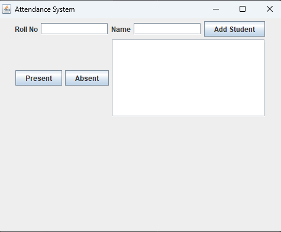
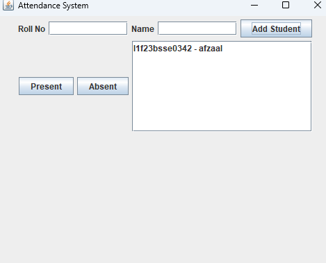
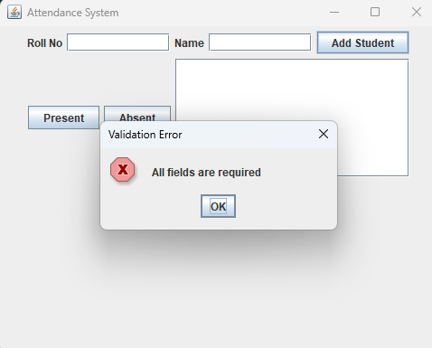

# Student Attendance Management System

## Project Description

The Student Attendance Management System is a desktop application developed in Java using Swing. The system allows users to add students, mark attendance, and view attendance records through a simple graphical user interface.

This project was developed as part of the Software Construction and Development (SCD) Lab Semester Project and demonstrates the implementation of Event Handling, Exception Handling, Code Refactoring, Unit Testing, and Git & GitHub version control.

---

## Features

* Add new students
* Mark students as Present or Absent
* Store attendance records in memory
* Input validation and error handling
* User-friendly GUI using Java Swing
* Unit testing using JUnit 5
* Clean and modular code structure

---

## Technologies Used

* Java
* Java Swing
* JUnit 5
* Git
* GitHub
* IntelliJ IDEA

---

## Project Structure

```text
AttendanceSystem-scd
│
├── src
│   ├── Student.java
│   ├── AttendanceManager.java
│   ├── MainFrame.java
│   └── Main.java
│
├── test
│   └── AttendanceManagerTest.java
│
├── screenshots
│
└── README.md
```

---

## Implemented Concepts

### Event Handling

* Add Student button
* Present button
* Absent button
* User interactions trigger application events

### Exception Handling

* Empty field validation
* Invalid input handling
* Runtime exception handling with error messages

### Code Refactoring

* Separate classes for business logic and GUI
* Meaningful naming conventions
* Modular and maintainable code structure

### Unit Testing

The following functionalities are tested using JUnit:

* Add Student
* Mark Attendance
* Attendance Percentage Calculation

### Git & GitHub

* Source code managed using Git
* Meaningful commit history
* Project hosted on GitHub

---

## How to Run

### Using IntelliJ IDEA

1. Open the project in IntelliJ IDEA.
2. Ensure JDK 19 (or compatible version) is configured.
3. Run `Main.java`.
4. The Attendance Management System window will open.

---

## How to Run Tests

1. Add JUnit 5 dependency to the project.
2. Open `AttendanceManagerTest.java`.
3. Run the test class using IntelliJ IDEA.

Expected test cases:

* testAddStudent()
* testMarkAttendance()
* testAttendancePercentage()

---

## Screenshots

| Home Screen | Successful Operation | Validation Error |
|-------------|---------------------|------------------|
|  |  |  |
---

## Future Enhancements

* Save attendance records to a file
* Database integration
* Search students
* Attendance reports
* Export attendance data to CSV

---

## Author

Student Name: Muhammad Afzaal

Course: Software Construction and Development (SCD)

Semester Project
